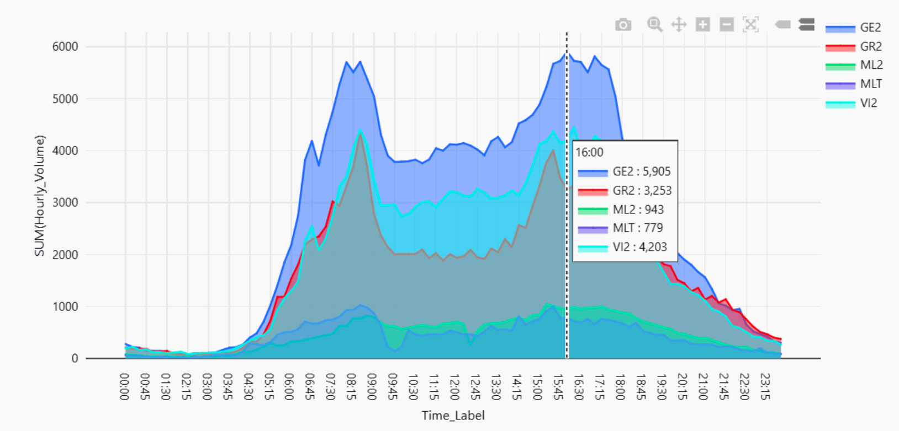
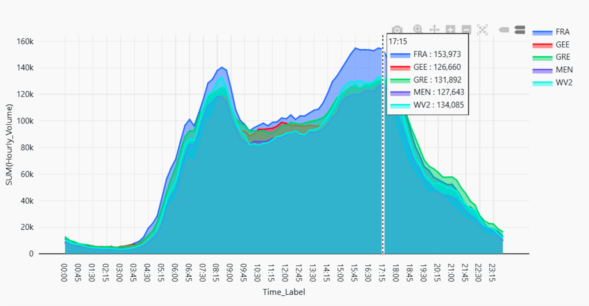

# 🚦 Traffic Sensor Data Pipeline (Medallion Architecture)

This project implements a PySpark-based data pipeline for analyzing traffic sensor data using the **Medallion Architecture** (Bronze → Silver → Gold). The pipeline processes raw CSV files into clean, analytics-ready Delta tables and integrates with Power BI to support dashboarding and business insights.

---

## 🏗️ Pipeline Architecture

The pipeline follows a modular, layered structure:

### 🔹 Bronze Layer - Raw Data Ingestion
- **Script**: `build_bronze.py`
- **Purpose**: Load unprocessed CSV files into Delta tables
- **Table**: `raw_traffic_<date>`

### 🔸 Silver Layer - Cleaned Star Schema
- **Script**: `build_silver.py`
- **Tables**:
  - `traffic_silver_fact`
  - `dim_region`, `dim_site`, `dim_time`, `dim_detector`
- **Purpose**: Clean, normalize, and join raw data into dimensional schema

### 🟡 Gold Layer - Aggregated Business Tables
- **Script**: `build_gold.py`
- **Tables**:
  - `traffic_gold_region_hourly`
  - `traffic_gold_detector_hourly`
  - `traffic_gold_region_monthly`
  - `traffic_gold_congestion_flags`
- **Purpose**: Generate summarized, query-optimized tables for analytics

---

## ✅ Testing Coverage

To validate each transformation step, tests are written for each layer:

| Layer  | Script                  | Validations                         |
|--------|-------------------------|-------------------------------------|
| Bronze | `build_bronze_test.py`  | Row count, basic ingestion checks   |
| Silver | `build_silver_test.py`  | Schema integrity, join correctness  |
| Gold   | `build_gold_test.py`    | Aggregation logic, column presence  |

---

## 📊 Power BI Integration

The Gold tables are connected to Power BI to produce interactive dashboards that provide meaningful insights into traffic volume, congestion, and regional trends.

### 🔗 Recommended Relationships
- Fact table `traffic_silver_fact` joins:
  - `dim_site` → via `NB_SCATS_SITE`
  - `dim_detector` → via `NB_DETECTOR`
  - `dim_time` → via time ID
- Gold tables are used for pre-aggregated, fast-access reporting

---

### 📈 Key Visualizations & Insights

#### 1️⃣ Hourly Traffic Volume by Region
- **Peak Traffic Hours**: Between **16:00 – 17:00**
- **Congestion Regions**: Noticeable spikes in `GE2`, `GR2`, and `VI2`

---

#### 2️⃣ Congestion Peaks at Specific Times
- **High Congestion Intervals**: Occur at **16:45** and **17:15**
- **Regions like `FRA`, `MEN`, `WV2` show significant volume increases**

---

## 🧠 Key Takeaways

Through this project, I gained hands-on experience in:
- Structuring a pipeline with **Medallion Architecture**
- Writing modular PySpark ETL code for **Delta Lake**
- Validating data transformation steps
- Creating actionable visualizations in **Power BI**

---

## 🚀 Future Improvements

- Enhance `dim_detector` with lane direction & type metadata
- Enable real-time streaming (Kafka → Delta) ingestion
- Schedule pipeline with **Airflow** or **Databricks Workflows**
- Optimize performance with **Z-Ordering** and **partitioning**

---

## 🛠️ Tech Stack

- Python + PySpark
- Delta Lake on Databricks
- Power BI (for visualization)
- Git & GitHub

---

📌 *Project implemented and customized by [Zhen Xin] for portfolio learning and demonstration.*
